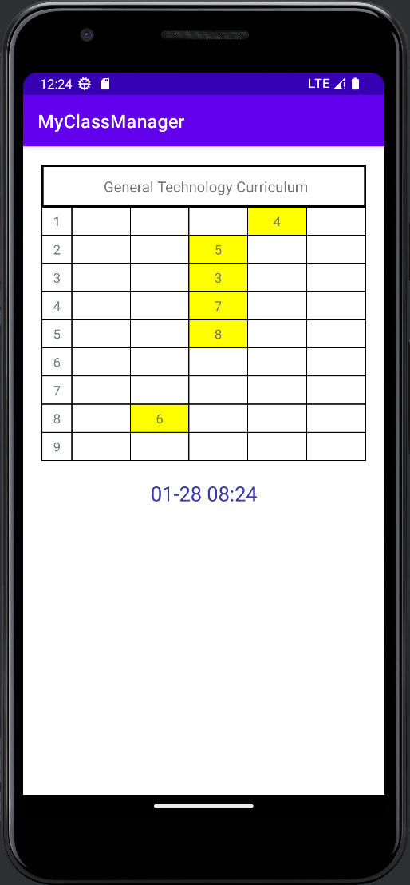
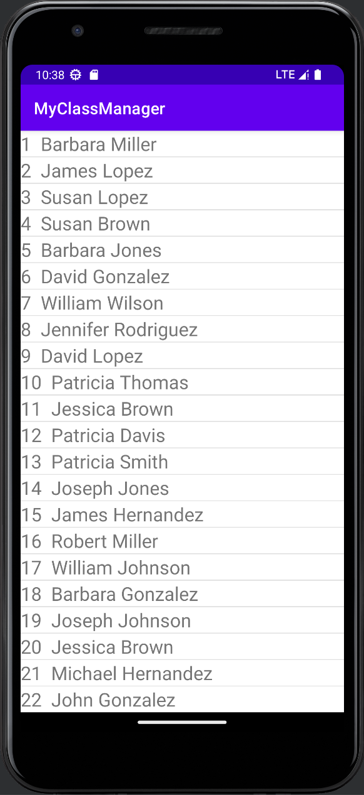
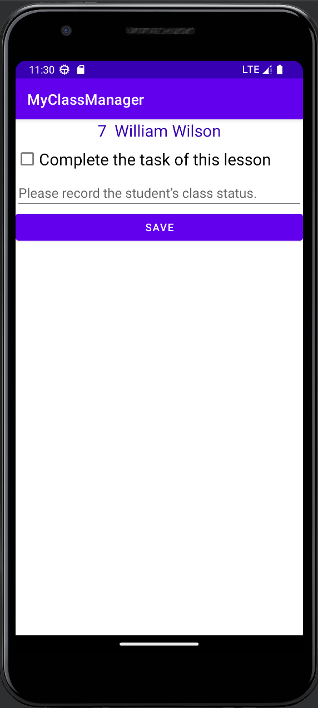

# I developed a class schedule and student performance record statistics app for Android phones.
## 1. Implementation of Android Studio dynamic table.
I teach high school students 6 general technology classes a week. Each class will be graded based on the 
completion of the usual classroom exercises. At the end of the semester, the total score will be used as the 
grade for the course. If this function is implemented on a mobile phone, compared to the paper version of the 
course schedule and grade book, the program on the mobile phone can have an automatic statistical function.
Data can also be easily shared, eliminating the need to re-enter paper records into the computer at the end of 
the semester. When I plan to use Android Studio to develop, the first thing I think of is to imitate the paper 
curriculum as the first page. Android Studio has built-in LinearLayout and GridLayout. But GridLayout cannot 
dynamically adjust the number of grids, nor can it generate click events. So I wrote a dynamic form myself.

## 2. Clicking on the yellow grid on the first page of the curriculum (that is, the grid with classes) 
will pop up the following list of all students in the class.

## 3. Click on a student's name again, and the recorded Notes will pop up to record the student's class performance and learning scores in the class.

